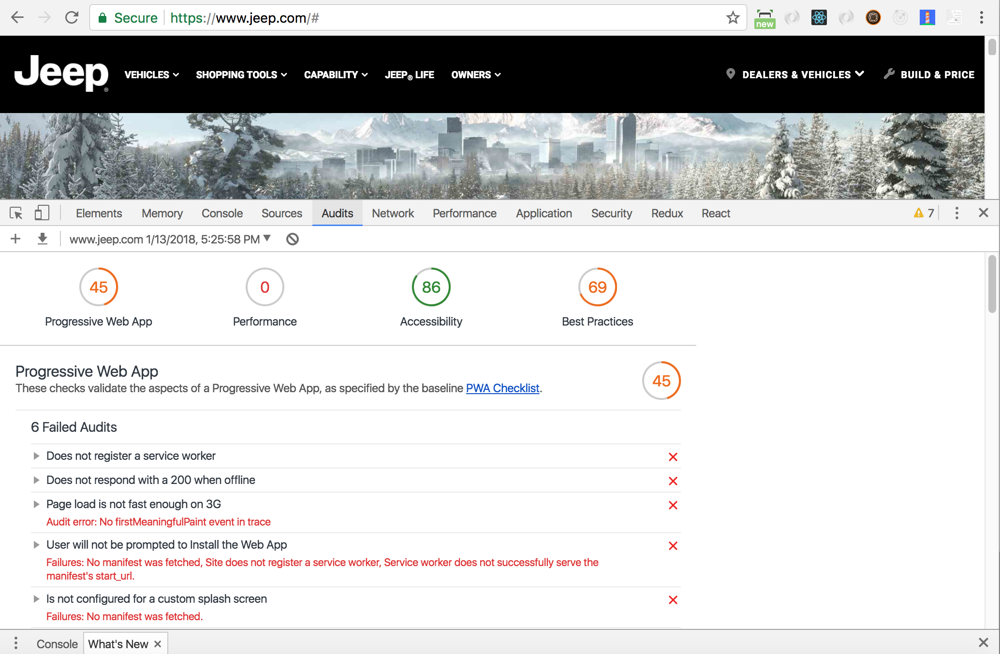
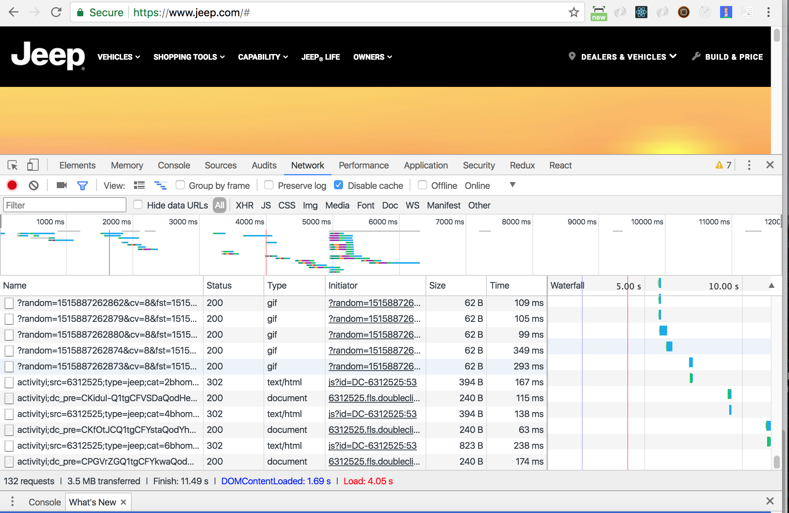

# JEEP.COM FRONT PAGE PROJECT

I built this website replication from scratch as part of a coding challenge for a Software Developer postion with a startup in North Austin. 

## Table of contents

* [technical specifications](#specs)

* [copy vs original performance comparison](#baseline)

* [testing and build process](#tests)

## Specs

The challenge is pretty straightforward. Recreate an exact copy of the current jeep.com front page. The only constraints specified by the client were that I must use Twitter bootstrap to build it (no specific version. 3 or 4 are both acceptable). This application, just like the original page, must also be fully mobile responsive.

A preliminary examination of the jeep.com website indicates that they're using Webpack, React, jQuery, Google Analytics, and possibly an adobe CMS. I'll attempt to stick to the technologies in use and limit the use of any technologies, frameworks, or libraries that are not in use on the real website.

I'll be using Bootstrap version 4 (in beta as of this writing). However, bootstrap V4 no longer ships with Glyphicons! So I'll be including the font-awesome css for icon styling.

FONT : Roboto
FONT COLOR : Pure white on black bg. Pure black on white bg. Shade of grey on grey background.
ICONS : font-awesome, placed in ::before or own span if necessary.

## Baseline

As of 1/11/2018 @ 5:30pm CST on a 2016 MacBook Pro 2.7 GHz Intel Core i5 running OSX 10.11.3, opened in Google Chrome version 63, over a Google Fiber internet setup operating at 52.7 Mbps down and 37.3 Mbps up; jeep.com's front page currently rates in at the following scores using Google Chrome's lighthouse auditing tool:

45/100 on Progressive Web Application. Points of note include : 

* No firstMeaningfulPaint event in trace when throttled down to simulare 3g network speeds.

* Does not register a service worker, responds with 200 OK even when offline, no configured splash screen, and Address bar not matching brand colors.

(In all fairness, most all of these can be resolved with a manifest.json & service worker. But it's fair to point out that Google has been spearheading the whole push towards Progressive Web Applications, and not everyone is onboard with it yet. So it's the exception rather than the rule if a web application scores very well in this category. I'm honestly more concerned with fixing the 3G network speed issue than I am with the service workers and manifest)

0/100 on Performance

* All errors are related to the total size of the web page. At 132 network requests and 3.5MB of data, this website loads slower than most. DOMContent varies between 1.58 - 2.05 seconds, Load between 3.40-4.05 seconds. But network requests continue until Finish which varies between 10.27 and 11.88 seconds.

86/100 on Accessibility

* A few images are missing 'alt' attributes.

* A few ids are being used more than once on the page.

* While technically not listed under this section, the original website uses javascript to asynchronously load in assets and images after the document has loaded (usually a good thing to ensure faster initial page load). However, the original page does not provide a fallback notice or content (missing `<noscript>` tag). The same page still renders with javascript disabled, albiet with a lot of missing images and broken functionality. I consider this bad practice. Why make the user wait for a website to load that they can't interact with? I'd rather display a fallback notice requesting that the user enable javascript in their browser.

69/100 on Best Practices 

* Uses `document.write()`.

* Includes jQuery 1.11.2, which is outdated and may have security vulnerabilities.

* Does not use images with appropriate aspect ratio. 

## Project

* robots.txt

* includes manifest

* noscript tags

## Tests
