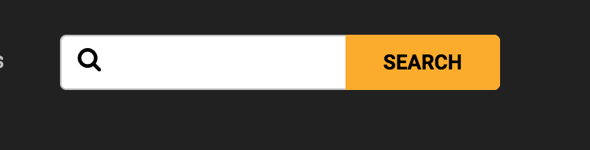

# JEEP.COM FRONT PAGE PROJECT

I built this website replication from scratch as part of a coding challenge for a Software Developer postion with a startup in North Austin. You can see this project deployed at multishifties.github.io/jeepfrontpage/ 

## Table of contents

* [technical specifications](#specs)

* [original website baseline](#baseline)

* [build process and differences](#project)

* [copy website performance](#tests)

* [if I had to do it over](#thoughts)

* [if I had to launch it into production](#production)

## Specs

The challenge is pretty straightforward. Recreate an exact copy of the current jeep.com front page. The only constraints specified by the client were that I must use Twitter bootstrap to build it (no specific version. 3 or 4 are both acceptable). This application, just like the original page, must also be fully mobile responsive.

A preliminary examination of the jeep.com website indicates that they're using Webpack, React, jQuery, Google Analytics, and possibly an adobe CMS. I'll attempt to stick to the technologies in use and limit the use of any technologies, frameworks, or libraries that are not in use on the real website.

I'll be using Bootstrap version 4 (in beta as of this writing). However, bootstrap V4 no longer ships with Glyphicons! So I'll be including the font-awesome css for icon styling.

## Baseline

As of 1/11/2018 @ 5:30pm CST on a 2016 MacBook Pro 2.7 GHz Intel Core i5 running OSX 10.11.3, opened in Google Chrome version 63, over a Google Fiber internet setup operating at 52.7 Mbps down and 37.3 Mbps up; jeep.com's front page currently rates in at the following scores using Google Chrome's lighthouse auditing tool:

45/100 on Progressive Web Application. Points of note include : 

* No firstMeaningfulPaint event in trace when throttled down to simulare 3g network speeds.

* Does not register a service worker, responds with 200 OK even when offline, no configured splash screen, and Address bar not matching brand colors.

(In all fairness, most all of these can be resolved with a manifest.json & service worker. But it's fair to point out that Google has been spearheading the whole push towards Progressive Web Applications, and not everyone is onboard with it yet. So it's the exception rather than the rule if a web application scores very well in this category. I'm honestly more concerned with fixing the 3G network speed issue than I am with the service workers and manifest)

0/100 on Performance

* All errors are related to the total size of the web page. At 132 network requests and 3.5MB of data, this website loads slower than most. DOMContent varies between 1.58 - 2.05 seconds, Load between 3.40-4.05 seconds. But network requests continue until Finish which varies between 10.27 and 11.88 seconds.

86/100 on Accessibility

* A few images are missing 'alt' attributes.

* A few ids are being used more than once on the page.

* While technically not listed under this section, the original website uses javascript to asynchronously load in assets and images after the document has loaded (usually a good thing to ensure faster initial page load). However, the original page does not provide a fallback notice or content (missing `<noscript>` tag) if JavaScript is Disabled. The same page still renders with javascript disabled, albiet with a lot of missing images and broken functionality. In my copy I've added a simple fallback notice requesting that the user enable javascript in their browser.

69/100 on Best Practices 

* Uses `document.write()`.

* Includes jQuery 1.11.2, which is outdated and may have security vulnerabilities.

* Does not use images with appropriate aspect ratio. (In all fairness, the difference between the actual image aspect ratio and the displayed aspect ratio is less than 10%. And because I'll be re-creating this website using the same images and display size specifications, I fully expect that my copy will suffer from this same issue.)

## Project

I've gone ahead and made a few modifications to the copy I built as I saw fit. Among them are the following : 

* Built a simple robots.txt. There's not a lot to see here, this is mostly a spec-compliance thing. 

* Includes web manifest. I put together a simple manifest JSON to allow this website to run as a PWA for mobile devices. 

* Added `Noscript` tags. It's important to notify the user if JavaScript is disabled.

* Boost chevron size for dropdown menus and clickable links. The original chevrons appear a font-size or two smaller than the text they're referencing. The original website also appears to, for whatever reason, use several different sizes of them. I decided to standardize and enlarge them a bit to make them stand out more. For reference : 

Original Header : 
 

My Header  :

* Change carousel buttons. The original website uses a different gliphycon set than I have with Bootstrap. Their carousel buttons, when hovered over, also cast a shadow that does not extend to the bottom of the image carousel. It's a minor bug in the website, and one I had no intention of replicating. I opted instead to use the Bootstrap default carousel buttons (although I did modify them a bit to boost visibility and styling). For reference : 

Original Button : 

My Button : 

* Use only Roboto font at 400/700 weights. The original website uses a mixture of fonts and weights. Including Proxima Nova headers, which unfortunately are not free or open source. On the upside, My website will have one less resource to reqest!

* Changed a few glyphicons. I was told to use bootstrap, so I'm sticking to bootstrap and FA icons. Which means I've had to make a few substitutions. They're minor, but worth a mention.

Original Info Disclaimer : 

My Info Disclaimer : 

Original Search Bar : 

Copy Search Bar : 

## Tests

Once everything is built, I'll audit the website both on Github pages and off of a local server and post the results here.

## Thoughts

Use bootstrap mobile visibility classes instead of rolling own utility class. Separate util class if own custom breakpoints are needed.

## Production

Minify assets as npm script. Probably use a view engine to allow for ease of content management.
